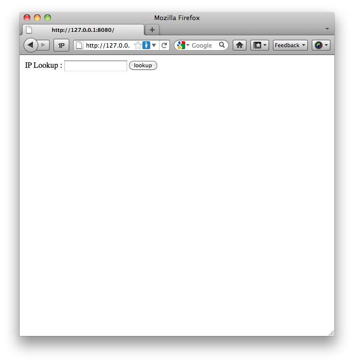
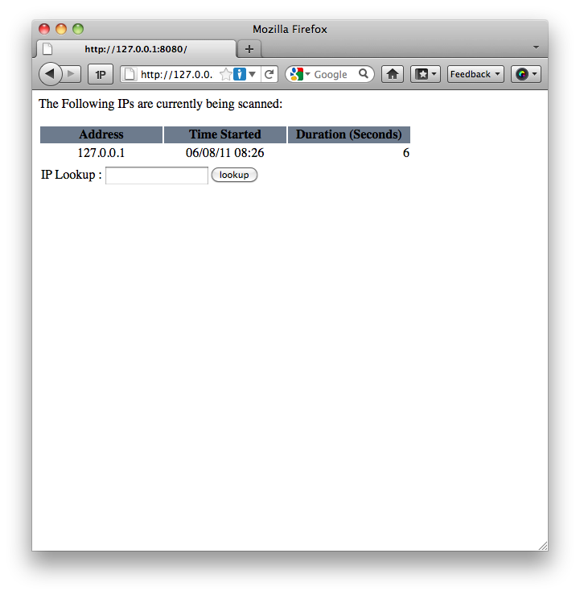
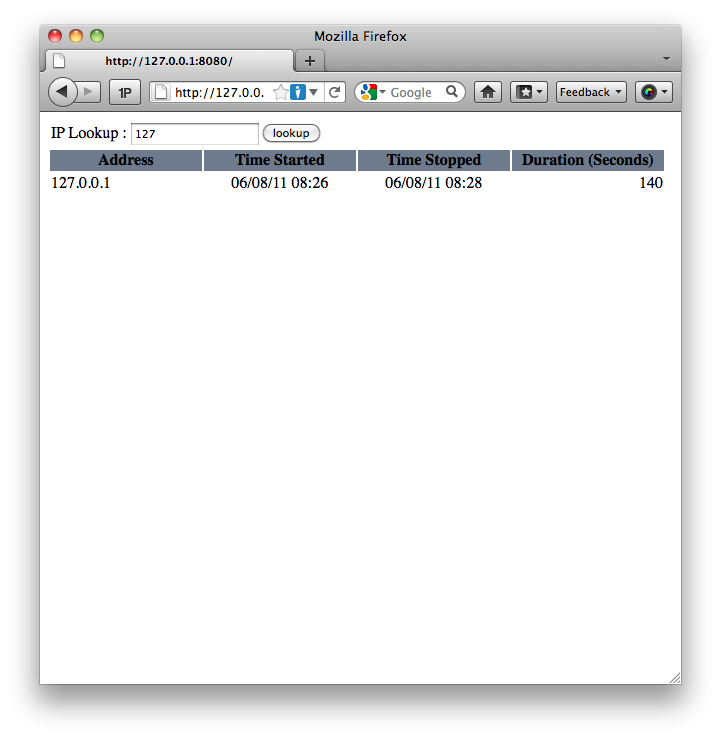

Nessus Scan Monitor
===================

What does it do?
----------------
Nessus scan monitor will watch the nessusd.messages log on all of the nessus scanners that you have in your environment and will keep a central repository of all of the IPs it has scanned, when they were last scanned, how long the scan took, and if there are any scans running currently.

How does it work?
-----------------
There are 2 components, the WSGI application and the client code that runs on all of the scanners.  The WSGI component has a very basic api to allow the client to very simply notify the WSGI application when a scan has started and stopped.  The WSGI Application also has a basic search function that allows users to see what IPs are currently being scanned and search the last scanned times of any IP in the database.

Getting it Running
------------------

Below are the requirements needed to get the WSGI application running.

* Python 2.6 or 2.7 is needed (Code has not been tested with anything else)
* Python SQLAlchemy module
* Python Bottle Module

Step-by-step:

1. Download the latest code
2. `sudo apt-get install python-dev python-setuptools`
3. `sudo easy_install sqlalchemy bottle`
4. Rename the example config.ini to config.ini
5. Adjust any settings in the config.ini that are needed.
6. `python scan_monitor_app.py`

If you completed the above steps properly, then you should receive the following prompt:

    Bottle server starting up (using WSGIRefServer())...
    Listening on http://127.0.0.1:8080/
    Use Ctrl-C to quit.

If this is the case, then the server is running!  Go ahead and open a browser and goto the application:

As this is a test endironment and we do not have any client up (yet) we can mimick the behaviour of a client by using a browser window to interact with the api.  Open a new browser and goto the following url:

**http://127.0.0.1:8080/api/start/127.0.0.1**

Now if you refresh the page of the browser window with the application up, you should see something similar to this:

Now if we tell the application that the scan has stopped, we can then search for it.  To tell the application that the scan has "stopped" enter the following url into your second browser window:

**http://127.0.0.1:8080/api/start/127.0.0.1**

If you refresh your browser window with the application homepage, you should see what looks like the first screen.  The currently being scanned portion of the page has gone away.  However since you now have a "completed scan" in the database, we can search for it.  In the example below, I simply searched for '127' and got the response below:

Installing the Client
---------------------

Installing the client is very easy.  The only requirement in this case is that your scanners have Python version s 2.6 or 2.7 installed.

1. Download the latest code
2. Rename the example config.ini to config.ini
3. Adjust the client's configuration to be able to talk to the WSGI app.
4. `python scan_monitor.py`

If everything works ok, then the client should daemonize into the background and return you to the shell prompt.  Thats it!

Setting up the WSGI Service to run through Apache
-------------------------------------------------

If you want to run the WSGI script via Apache, then there are a few extra steps that you will need to take in order to get everything off the ground.

1. Install the mod_wsgi apache module: `sudo apt-get install libapache2-mod-wsgi`
2. Uncomment the following lines in scan\_monitor\_app.py:

    os.chdir(os.path.dirname(__file__))
    application = bottle.default_app()

3. Comment out the following lines in scan\_monitor\_app.py:

    debug(True)
    run(port=int(config('Settings', 'Port')), host=config('Settings', 'Host'))

4. Create a new VHost in apache using this example config:

    <VirtualHost *:80>
        ServerName scan_monitor.domain.com

        WSGIDaemonProcess scan\_monitor user=www-data group=www-data processes=1 threads=5
        WSGIScriptAlias / /srv/sites/scan\_monitor/www/scan\_monitor\_app.wsgi

        <Directory /srv/sites/scan\_monitor/www>
            WSGIProcessGroup scan_monitor
            WSGIApplicationGroup %{GLOBAL}
            Order deny,allow
            Allow from all
        </Directory>

        ErrorLog /srv/sites/scan\_monitor/logs/error.log
        LogLevel warn
        CustomLog /srv/sites/scan\_monitor/logs/access.log combined
    </VirtualHost>

5. Rename scan\_monitor\_app.py to scan\_monitor\_app.wsgi
6. Restart Apache.